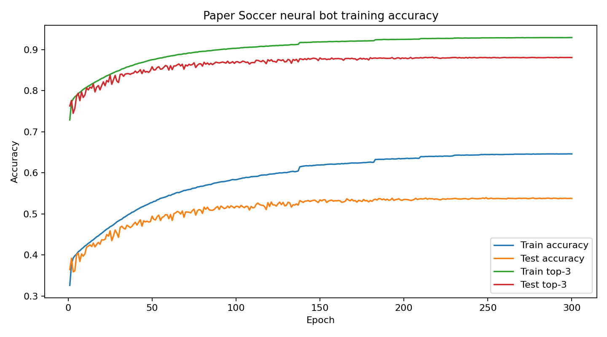
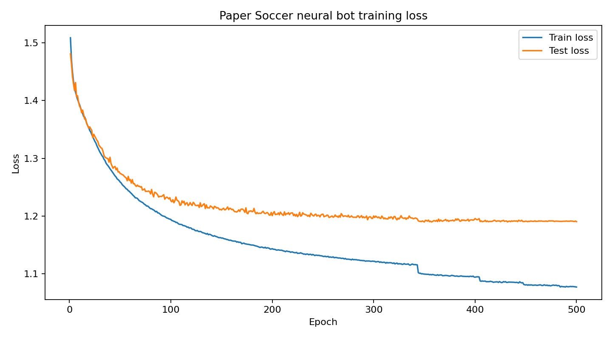
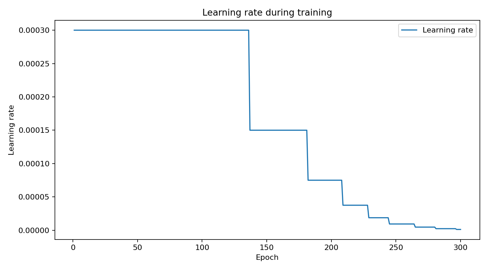
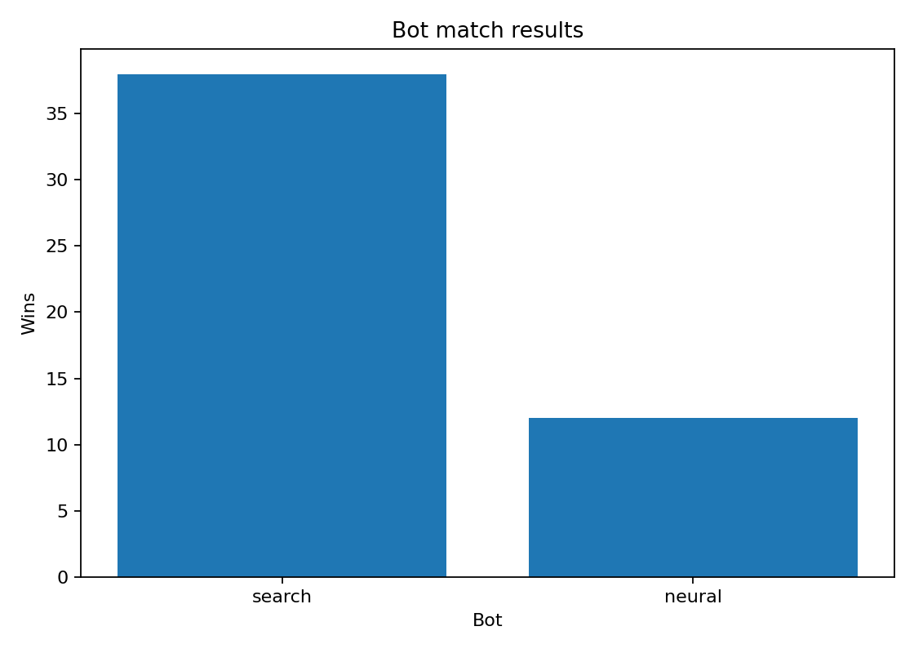
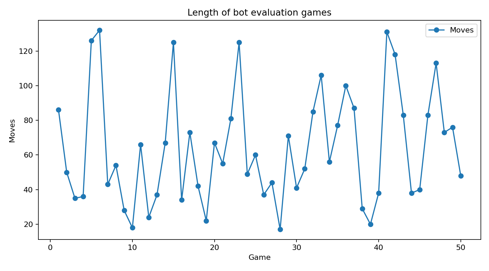
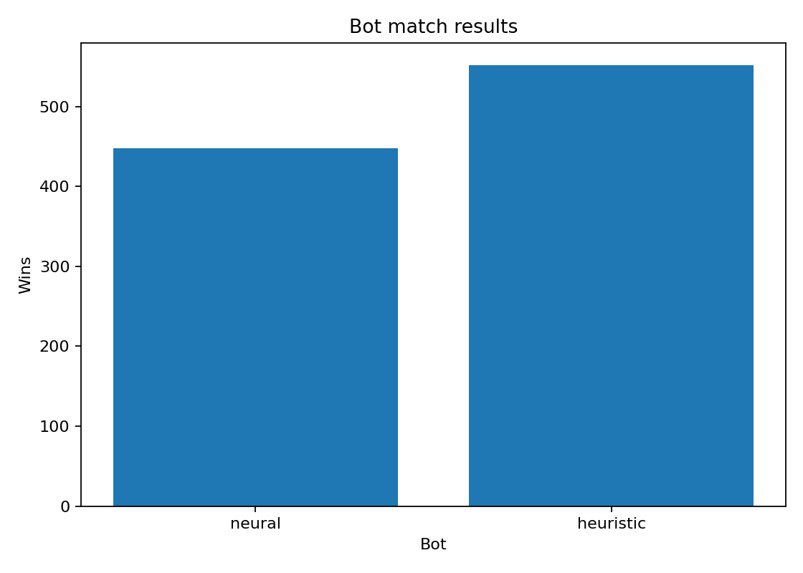
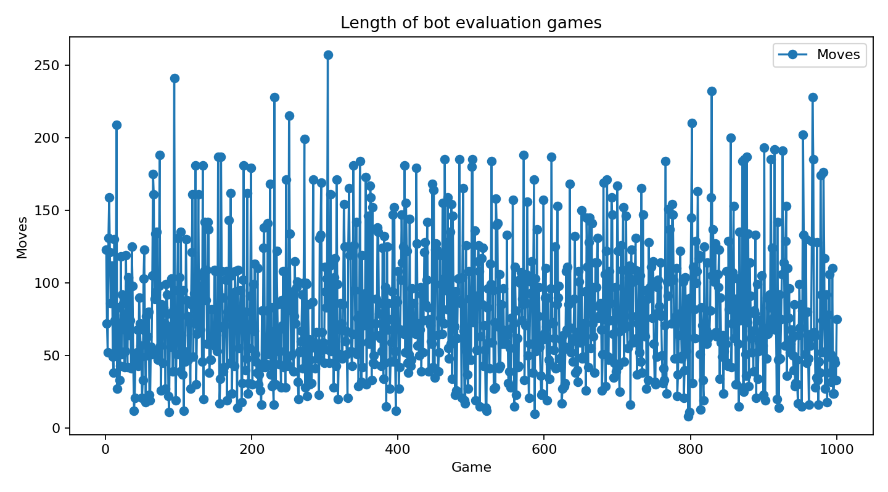
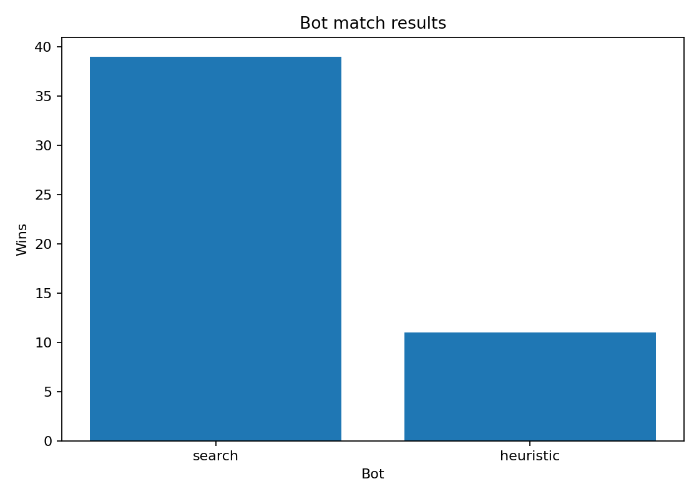
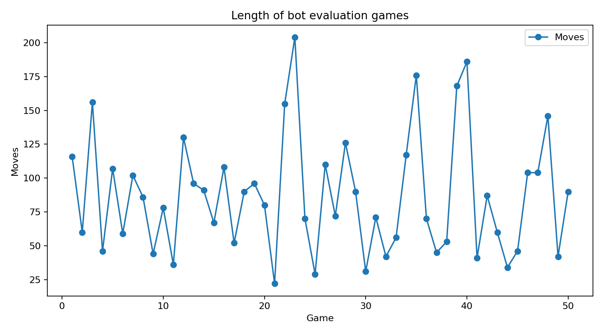

# Paper Soccer AI

## Project description

Paper Soccer AI is a project created for the **Applied Machine Learning** course.
The goal of the project is to implement the classic **Paper Soccer** game and test several computer players, including a simple neural-network player trained with **PyTorch**.

The project is split into two main parts:

```text
C++    -> game engine, rules, legal moves and gameplay loop
Python -> bots, search algorithm, dataset generation, training and web visualization
```

Paper Soccer is a two-player strategy game played on a rectangular grid. Players move the ball by drawing lines between neighboring points. A used line cannot be used again. The objective is to reach the opponent's goal or force the opponent into a position with no legal moves.

Even though the rules are simple, the game can quickly become strategic. Each move changes the board, blocks one edge and may create an extra move because of the bounce rule. This makes the game a nice small environment for testing search algorithms and neural networks.

---

## Game rules

The game is played on a grid with two goals. In this project the board size is:

```text
Width: 11 vertices
Height: 13 vertices
Goal width: 5 vertices
```

### Basic rules

1. The ball starts in the middle of the board.
2. Players take turns moving the ball.
3. A move is made to one of 8 neighboring points.
4. A line that was already used cannot be used again.
5. The ball cannot leave the field, except when it enters a goal.
6. A player wins by moving the ball into the opponent's goal.
7. If a player has no legal moves, that player loses.

### Bounce rule

If the ball reaches a point that was already visited, or reaches the border of the field, the same player moves again.

Because of this, one turn may contain more than one small move. This is one of the reasons why Paper Soccer is more interesting than it looks at first.

---

## Move controls

In the terminal version, moves are selected using numpad-style controls:

```text
7 8 9
4   6
1 2 3
```

They correspond to directions around the current ball position:

```text
8 -> up
9 -> up-right
6 -> right
3 -> down-right
2 -> down
1 -> down-left
4 -> left
7 -> up-left
```

In the web version, legal moves are shown as green clickable circles.

---

## Implemented modes

When the game starts, the player can choose the bot mode:

```text
1 - heuristic
2 - search
3 - neural
```

### Heuristic Mode

The heuristic bot is a simple hand-written player. It does not simulate many future moves. Instead, it checks all currently legal directions and gives each resulting vertex a score.

The score is based mainly on:

- progress toward the opponent's goal
- mobility, meaning how many moves are still available from the next vertex
- trap penalty, if the move leads to a position with very few legal moves

In simplified form, the evaluation is:

```text
score = progress weight * progress + mobility weight * mobility - trap penalty
```

This makes the heuristic bot fast and useful as a baseline. It is not random, but it is also not a deep search algorithm.

### Search Mode

The search bot uses a minimax-like **negamax** search with alpha-beta pruning. It simulates possible moves ahead and evaluates future positions.

The search algorithm:

- clones the current game state
- checks all legal moves
- applies moves in the simulated state
- handles terminal positions such as goals and dead ends
- uses alpha-beta pruning to skip branches that cannot improve the result
- uses the heuristic evaluation at leaf positions

This mode is usually strong, because it actually looks ahead instead of only scoring the next move.

### Neural Mode

The neural bot uses a PyTorch policy network. The current board state is converted into one vector and passed to a fully connected neural network. The network outputs 8 scores, one for each possible direction.

Illegal moves are masked before choosing the final move. This means the neural bot is not allowed to select a move that breaks the game rules.

The neural bot is trained from examples generated by the search bot. In this project, the neural network tries to imitate the search-based expert and learn useful move preferences from many board positions.

---

## Machine learning approach

The machine learning part treats Paper Soccer as a **policy learning** problem. The model does not try to predict the final winner directly. Instead, for a given board position, it predicts which move should be played next.

```text
board state -> neural network -> 8 move scores
```

The network output has 8 values, one for each direction:

```text
0 - up
1 - up-right
2 - right
3 - down-right
4 - down
5 - down-left
6 - left
7 - up-left
```

The state vector contains the most important information needed to describe the current position:

- current player
- current ball position
- allowed directions from every vertex
- visited / extra-turn vertices

The neural network does not replace the game rules. The C++ engine and Python logic still check legal moves, used edges, goals and dead ends. Before the neural bot chooses a move, illegal directions are masked, so the model can only select a legal move.

### Dataset generation

The dataset is generated with `generate_dataset.py`. First, the C++ engine creates the initial `gamestate.txt`. Then the Python script loads this state and simulates many games.

The final dataset generation settings were:

```text
games_count = 10000
max_moves_per_game = 400
epsilon = 0.30
expert_depth = 5
```

For each generated position, the search bot is used as an expert. The expert checks all legal moves and assigns a score to each move using negamax search. This means the neural network is trained to imitate a stronger look-ahead player, not only a simple heuristic.

For every state, the generator saves:

```text
state vector          -> input for the neural network
expert move scores    -> target values from the search bot
legal move mask       -> information which directions are legal
best move index       -> strongest expert move
```

### Expert move scores

The function `move_scores()` calculates the expert labels. It creates a vector of 8 scores and a legal move mask. Then, for each legal move, it clones the current state, applies the move and evaluates the resulting position.

If the move immediately ends the game, the terminal value is used directly. Otherwise, the future position is evaluated using negamax search with the chosen expert depth.

Extra turns are handled carefully. If a move gives the same player another turn, the value is not negated, because the same player still controls the next move. If the turn changes to the opponent, the value is negated. This is important because the bounce rule makes Paper Soccer different from a simple alternating-turn game.

### Epsilon exploration

The parameter `epsilon = 0.30` is used only during simulation to make the dataset more diverse.

During simulated games:

```text
70% of the time -> play the best expert move
30% of the time -> play a random legal move
```

The random move is not used as the training label. The labels are still calculated by the search expert. Epsilon only changes the path through the game, so the generator can reach more varied positions instead of repeating very similar expert-only games.

This helps the model see:

- normal strong positions
- less common positions
- recovery positions after imperfect moves
- states that would not appear often in pure expert self-play

### Target normalization

Raw search scores can be very large, especially near winning or losing positions. To keep training stable, the legal expert scores are first clamped:

```text
legal scores are clamped to the range [-20, 20]
```

Then only the legal scores are normalized. The script subtracts the mean and divides by the standard deviation. If there is only one legal move, or if the standard deviation is too small, the script avoids unstable division.

This produces smoother target values for the neural network and avoids problems such as extremely large losses or `NaN` values during training.

### Duplicate state removal

The generator also removes duplicate positions. Each state is identified by a key containing:

- current player
- current ball vertex
- allowed move matrix
- visited / extra-turn vertices

If the same state appears again, it is skipped. This keeps the dataset cleaner and prevents training from being dominated by repeated positions.

### Training the neural bot

The neural bot was trained to imitate the search-based expert. Instead of manually defining all strategic rules, the model learns move preferences from many generated board positions.

The training is based on two targets:

```text
expert score distribution -> teaches how good each legal move is
best expert move          -> teaches the strongest move directly
```

Because of this, the model is not trained only as a simple classifier. It also learns the relative quality of alternative moves. This is useful in Paper Soccer, where several legal moves can often be close in value.

Illegal moves are masked during training and evaluation. This means the model is not rewarded or punished for impossible moves, and during gameplay it can only choose from legal directions.

The model was trained for a longer 500 epochs run on the server. The best saved model resuls are shown in the section below.

The exact accuracy shows how often the model selected the same best move as the search expert. The top-3 accuracy shows how often the expert move was among the three highest neural scores. The high top-3 accuracy suggests that the model learned useful move preferences, even when its first choice was not always exactly the same as the expert.


### Final training results

The final longer training run was performed for 500 epochs on the agile server. The best saved model reached:

```text
Best test accuracy: 0.5698
Best test top-3 accuracy: 0.8955
```

The last epoch finished with:

```text
Epoch: 500/500
Learning rate: 0.000013
Train loss: 1.0771
Train accuracy: 0.6476
Train top-3 accuracy: 0.9302
Test loss: 1.1904
Test accuracy: 0.5679
Test top-3 accuracy: 0.8960
```

The exact test accuracy means that the neural network selected the same best move as the search expert in about 57% of test positions. The top-3 accuracy means that in almost 90% of test positions, the expert move was among the three highest-scored neural moves.

This is useful for Paper Soccer because many positions have several reasonable moves with similar values. Therefore, top-3 accuracy gives an additional view of how well the model learned the expert preferences, not only the single highest move.

---

## Project structure

```text
paper-soccer-ai/
├── cpp/
│   ├── include/
│   │   ├── direction.hpp
│   │   ├── field.hpp
│   │   ├── game.hpp
│   │   └── types.hpp
│   ├── src/
│   │   ├── field.cpp
│   │   ├── game.cpp
│   │   └── main.cpp
│   └── CMakeLists.txt
│
├── python/
│   ├── dataset.py
│   ├── evaluation.py
│   ├── generate_dataset.py
│   ├── model.py
│   ├── parse.py
│   ├── play.py
│   ├── search_bot.py
│   ├── train.py
│   ├── evaluate_bots.py
│   ├── plot_results.py
│   └── web_server.py
│
├── README.md
└── instruction.txt
```

---

## What each part does

### C++ files

`direction.hpp` defines the 8 possible move directions, direction masks and opposite directions.

`types.hpp` stores shared type aliases used by the field and game logic.

`field.hpp` and `field.cpp` build the board. They calculate vertices, borders, goals, neighbors and initially allowed directions.

`game.hpp` and `game.cpp` contain the main game rules. They store the current player, ball position, used edges, visited points, winner detection, dead-end detection and saving the game state to `gamestate.txt`.

`main.cpp` is the main game program. It lets the user choose a side, choose a bot mode, play in the terminal or run the web mode. It also calls the Python bot when the AI has to move.

`CMakeLists.txt` is used to build the C++ executable with CMake.

### Python files

`parse.py` loads `cpp/gamestate.txt` and converts it into a Python `GameState` object. It also creates the tensor input used by the neural network.

`evaluation.py` contains the heuristic evaluation functions. It scores positions and moves using simple game logic.

`search_bot.py` contains the search-based bot. It clones game states, applies moves, checks terminal positions and uses negamax with alpha-beta pruning.

`play.py` is called by the C++ program when the bot needs to move. It reads the current game state, chooses a move using heuristic, search or neural mode, and saves the chosen move into `move.txt`.

`model.py` defines the neural network architecture and the function for choosing the best legal neural move.

`generate_dataset.py` generates training samples by simulating games and using the search bot as an expert. It saves tensors such as states, targets, legal masks and best moves.

`train.py` trains the neural network on the generated dataset. It splits the data into training and test parts, trains the model, evaluates it and saves the best model and training history.

`evaluate_bots.py` runs bot-vs-bot tests, for example neural vs search or neural vs heuristic, and saves match results to CSV files.

`plot_results.py` creates plots from the training history and bot evaluation results.

`dataset.py` defines a small PyTorch dataset wrapper.

`web_server.py` starts a local web server. It shows the board in the browser, refreshes the game state and lets the human player choose legal moves by clicking. The current web version also supports live bot-vs-bot matches.

---

## Training Explanation

The training pipeline uses tensors saved by `generate_dataset.py`:

```text
states.pt       -> board states
targets.pt      -> expert move scores
legal_masks.pt  -> which moves are legal
best_moves.pt   -> best move index for each state
```

In `train.py`, these tensors are combined into one dataset:

```python
dataset = TensorDataset(states, targets, legal_masks, best_moves)
```

Then the dataset is split into training and testing data:

```python
train_size = int(0.9 * len(dataset))
test_size = len(dataset) - train_size
```

This means:

- `90%` of all samples are used for training
- `10%` of all samples are used for testing

The model is trained as a policy network. It receives a board state and outputs 8 move scores. Illegal moves are masked, so the network is evaluated only on legal directions.

The final loss combines two parts:

```text
soft target loss      -> learns from the full expert score distribution
hard cross entropy    -> still encourages the exact best expert move
```

This is useful because in Paper Soccer several moves can have similar search values. The soft target part allows the model to learn close alternatives instead of treating every non-best move as completely wrong.

The script also tracks:

```text
train loss
test loss
exact accuracy
top-3 accuracy
learning rate
```

The best model is saved when test accuracy improves:

```text
python/saved_models/policy_model_v3.pth
```

The training history is saved to:

```text
python/saved_models/training_history_v3.csv
```

### Training plots

The plots below are generated from `training_history_v3.csv` using `plot_results.py`.







## Important dataset note

The heavy `.pt` dataset files are not included in the repository (they are roughly 3GB once generated). They can be generated again when needed.

At the moment, `generate_dataset.py` saves data into:

```text
python/data/
```

and `train.py` expects data in:

```text
python/data/
```

---

## How to run

### 1. Create Python Environment

From the project root:

```bash
python -m venv .venv
```

Activate it on Windows:

```bash
.venv\Scripts\activate
```

Install needed packages:

```bash
pip install torch
```

### 2. Build the C++ Game

Go to the `cpp` folder:

```bash
cd cpp
```

Configure and build:

```bash
cmake -S . -B build
cmake --build build
```

The executable should be created in:

```text
cpp/build/soccer.exe
```

### 3. Run the Terminal Game

From the `cpp` folder:

```bash
./build/soccer.exe
```

Then choose:

```text
0 - Top
1 - Bottom
```

and choose a bot:

```text
1 - heuristic
2 - search
3 - neural
```

Use the numpad-style controls to make moves.

### 4. Run the Web Version

The newest web version is started directly from the Python web server.  
You do not need to manually start the C++ game in a second terminal.

From the project root, run:

```bash
python python/web_server.py
```

Then open the address printed in the terminal. Usually it will be:

```text
http://localhost:8000
```

If port `8000` is blocked, the server may use:

```text
http://localhost:8080
```

In the browser panel there are two main parts:

```text
Human game  -> play manually against heuristic, search or neural bot
Live match  -> watch bot-vs-bot games, for example neural vs search
```

For human mode, choose your side, bot mode, search depth and search thinking time, then press:

```text
Start human game
```

For live bot matches, choose the top bot, bottom bot and search settings, then press:

```text
Start live bot match
```

The web server starts or restarts the C++ game automatically. The board is shown in the browser and refreshes during play. When it is your turn, click one of the green legal move circles.

The search thinking time only affects the search bot. Heuristic and neural modes are almost instant. Live bot matches use a small random opening so that deterministic bots do not always repeat exactly the same game.

---

## How to generate data and train the neural network

First make sure the C++ game created an initial `gamestate.txt`. You can run:

```bash
cd cpp
./build/soccer.exe init
```

Then generate the dataset:

```bash
cd ..
python python/generate_dataset.py
```

After that, make sure `train.py` reads from the same folder where the dataset was saved. Then run:

```bash
python python/train.py
```

After training, the model should be saved in:

```text
python/saved_models/policy_model_v2.pth
```

Then neural mode can load this model and use it during the game.

---

## How to evaluate and plot results

To run bot-vs-bot evaluation from the terminal:

```bash
python python/evaluate_bots.py --bot-a neural --bot-b search --games 50 --search-time 0.02 --search-depth 8 --opening-random 3

python python/evaluate_bots.py --bot-a neural --bot-b heuristic --games 1000 --opening-random 4

python python/evaluate_bots.py --bot-a heuristic --bot-b search --games 50 --search-time 0.02 --search-depth 8 --opening-random 3
```

The results are saved in:

```text
python/evaluation_results/
```

To generate plots from training and evaluation files:

```bash
python python/plot_results.py
```

The generated plots are saved in:

```text
python/plots/
```

### Evaluation plots

The bot match plots are ordered in the same order as the evaluation commands.

#### 1. Neural vs search





#### 2. Neural vs heuristic





#### 3. Heuristic vs search





---


## Authors

Project created for the Applied Machine Learning course at AGH.

Authors:

- Michał Pluciński
- Patryk Kuna

---